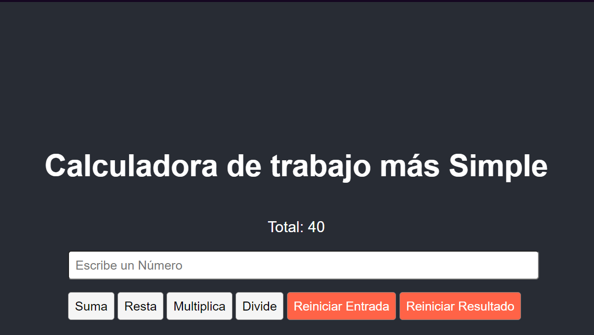

Claro, aquí tienes un ejemplo de un archivo `README.md` para tu aplicación React:

---

# Simple Work Calculator

A basic calculator built with React that performs arithmetic operations (addition, subtraction, multiplication, and division) and includes functionality to reset the input and result.

## Screenshot



## Table of Contents

- [Demo](#demo)
- [Features](#features)
- [Installation](#installation)
- [Usage](#usage)
- [Technologies](#technologies)
- [License](#license)

## Demo

Check out a live demo of the Simple Work Calculator:

[Live Demo Link (if applicable)]

## Features

- Perform basic arithmetic operations:
  - Addition
  - Subtraction
  - Multiplication
  - Division
- Reset input field and calculation result with a single click.

## Installation

Follow these steps to get the project up and running on your local machine:

1. Clone the repository:

   ```bash
   git clone https://github.com/yourusername/simple-work-calculator.git
   ```

2. Navigate to the project directory:

   ```bash
   cd simple-work-calculator
   ```

3. Install dependencies:

   ```bash
   npm install
   ```

4. Start the development server:

   ```bash
   npm start
   ```

The app will be running at `http://localhost:3000`.

## Usage

1. Enter a number in the input field.
2. Choose an operation (Addition, Subtraction, Multiplication, or Division).
3. Click the respective button to see the result.
4. Use the "Reiniciar Entrada" button to clear the input field.
5. Use the "Reiniciar Resultado" button to reset the result back to 0.

## Technologies

- React
- JavaScript (ES6+)
- HTML5 & CSS3

## License

La licencia **CC BY-NC-SA** (Creative Commons Attribution-NonCommercial-ShareAlike) es una licencia que permite a otros distribuir, remezclar, adaptar y construir a partir de tu trabajo, siempre que te den crédito, no lo utilicen con fines comerciales, y licencien sus nuevas creaciones bajo los mismos términos.

Para cambiar la licencia a **CC BY-NC-SA** en el archivo `README.md`, solo debes actualizar la sección de "License" con el texto adecuado. Aquí te muestro cómo hacerlo:

---

## License

This project is licensed under the **Creative Commons Attribution-NonCommercial-ShareAlike 4.0 International (CC BY-NC-SA 4.0)** license.

You are free to:

- **Share** — copy and redistribute the material in any medium or format.
- **Adapt** — remix, transform, and build upon the material.

Under the following terms:

- **Attribution** — You must give appropriate credit, provide a link to the license, and indicate if changes were made. You may do so in any reasonable manner, but not in any way that suggests the licensor endorses you or your use.
- **NonCommercial** — You may not use the material for commercial purposes.
- **ShareAlike** — If you remix, transform, or build upon the material, you must distribute your contributions under the same license as the original.

Read more about this license at [CC BY-NC-SA 4.0](https://creativecommons.org/licenses/by-nc-sa/4.0/).
